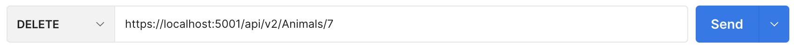

# Animal Shelter API

#### Animal Shelter application for the creation of an API using MVC for CRUD

#### By [Anton Ch](https://github.com/anton3ch)

## Technologies Used

- C#
- .NET 6.0
- ASP.NET Core
- MVC/API architecture
- Versioning

## Description

Animal Shelter API lets users employ the API to manipulate/query the database and use the endpoints to implement the functionality in their own projects.

## Setup/Installation Requirements

- Clone this repository to your Desktop:
  1. Your computer will need to have GIT installed. If you do not currently have GIT installed, follow [these](https://docs.github.com/en/get-started/quickstart/set-up-git) directions for installing and setting up GIT.
  2. Once GIT is installed, clone this repository by typing following commands in your command line:
     <pre>
     ~ $ cd Desktop
     ~/Desktop $ git clone https://github.com/anton3ch/AnimalShelterApi.Solution.git
     ~/Desktop $ cd AnimalShelterApi.Solution
  </pre>
- Install the [.NET 6 SDK](https://dotnet.microsoft.com/en-us/download/dotnet/6.0)
- Create appsettings.json file:
  <pre>
   ~/Desktop/AnimalShelterApi.Solution $ cd AnimalShelterApi
   ~/Desktop/AnimalShelterApi.Solution/AnimalShelterApi $ touch appsettings.json
   ~/Desktop/AnimalShelterApi.Solution/AnimalShelterApi $ echo '{
      "Logging": {
        "LogLevel": {
          "Default": "Warning",
          "System": "Information",
          "Microsoft": "Information"
        }
      },
      "AllowedHosts": "*",
      "ConnectionStrings": {
        "DefaultConnection": "Server=localhost;Port=3306;database=animalShelter_api;uid=root;pwd=[PASSWORD];"
      }
    }' > appsettings.json
  </pre>
  [PASSWORD] is your password
- Install packages and tools:
  <pre>
  ~/Desktop/AnimalShelterApi.Solution/AnimalShelterApi $ dotnet restore
  </pre>
- Run Migration to create a database:
  <pre>
  ~/Desktop/AnimalShelterApi.Solution/AnimalShelterApi $ dotnet ef migrations add Initial
  </pre>
- Update Database:
  <pre>
  ~/Desktop/AnimalShelterApi.Solution/AnimalShelterApi $ dotnet ef database update
  </pre>
- Build the project:
  <pre>
   ~/Desktop/AnimalShelterApi.Solution/AnimalShelterApi $ dotnet build
  </pre>
- Run the project
  <pre>
   ~/Desktop/AnimalShelterApi.Solution/AnimalShelterApi $ dotnet run
  </pre>
- Access you API by following this link: [https://localhost:5001/api/v1/Animals](https://localhost:5001/api/v1/Animals) to try this application

## Endpoints

| Endpoints                           | Returns                        |
| ----------------------------------- | ------------------------------ |
| api/v{version}/animals              | All animals                    |
| api/v{version}/animals/1            | An animal with id = 1          |
| api/v{version}/animals?breed=sphinx | Animals filtered by breed      |
| api/v{version}/animals?name=zoe     | Animals filtered by name       |
| api/v{version}/animals?minimumAge=5 | Animals filtered by age        |
The {version} value in the endpoints should be replaced with the api version number.

### POST Requests

To make a POST request to `https://localhost:5001/api/v2/Animals`, an API call body is required. Example in JSON:
```
{
  "name" = "Lucy",
  "breed" = "Sphinx",
  "age" = 4
}
```

### PUT Requests
To make a PUT request to `https://localhost:5001/api/v2/Animals/{id}`, an API call body and animal id are required. Example in JSON:
```
{
  "AnimalId" = 7,
  "name" = "Lucy Smith",
  "breed" = "Sphinx",
  "age" = 5
}
```

### DELETE Requests

To make a DELETE request to `https://localhost:5001/api/v2/Animals/{id}`, an animal id is required. Example:




## Versioning

- To change default version of the API, replace highlighted code in Program.cs with desired version:
  <pre>
  ...
  builder.Services.AddApiVersioning(opt =>
      {
        opt.DefaultApiVersion = new ApiVersion<b><span style="color:red">(2,0)</span></b>;
        opt.ReportApiVersions = true;
        opt.AssumeDefaultVersionWhenUnspecified = true;
      });
  ...
  </pre>
- To add another version of API, add this class in AnimalsController.cs:
  <pre>
  ...
  [ApiVersion("2.0")]
  [Route("api/v{version:apiVersion}/[controller]")]
  public class VersionV2Controller : ControllerBase
  {
    // Code
  }
  ...
  </pre>
- To deprecate previous versions, add "Deprecated = true" for that version's class:
  <pre>
  ...
  [ApiVersion("1.0", <b><span style="color:red">Deprecated = true</span></b>)]
  [Route("api/v{version:apiVersion}/[controller]")]
  public class AnimalsController : ControllerBase
  {
    // Code
  }
  ...
  </pre>

### Queries
To query the API http://localhost:5001/api/v2/animals?{parameter}={value}

| Parameter|  Type  |        Description        | 
|----------|--------|---------------------------|
|   breed  | string | Animals filtered by breed |
|   name   | string | Animals filtered by name  |
|minimumAge|  int   | Animals filtered by age   |

## Known Bugs

-

## License

[ISC](https://opensource.org/licenses/ISC)

Permission to use, copy, modify, and/or distribute this software for any purpose with or without fee is hereby granted, provided that the above copyright notice and this permission notice appear in all copies.

THE SOFTWARE IS PROVIDED "AS IS" AND THE AUTHOR DISCLAIMS ALL WARRANTIES WITH REGARD TO THIS SOFTWARE INCLUDING ALL IMPLIED WARRANTIES OF MERCHANTABILITY AND FITNESS. IN NO EVENT SHALL THE AUTHOR BE LIABLE FOR ANY SPECIAL, DIRECT, INDIRECT, OR CONSEQUENTIAL DAMAGES OR ANY DAMAGES WHATSOEVER RESULTING FROM LOSS OF USE, DATA OR PROFITS, WHETHER IN AN ACTION OF CONTRACT, NEGLIGENCE OR OTHER TORTIOUS ACTION, ARISING OUT OF OR IN CONNECTION WITH THE USE OR PERFORMANCE OF THIS SOFTWARE.

Copyright (c) 01/20/2023 Anton Ch